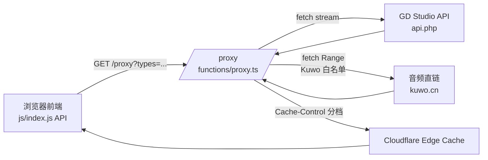

# GD Studio API Optimization

Feature Name: gdstudio-api-optimization
Updated: 2026-07-30

## Description

对齐 GD Studio 公共 API（`https://music-api.gdstudio.xyz/api.php`）文档与当前 Solara 播放器实现之间的偏差，统一后端缓存策略、增强上游错误与限流处理、收紧音频直链代理白名单、规范化前端 API 客户端写法，并保证全部改动可在 Cloudflare Pages Functions 免费套餐（Workers 兼容运行时、10ms CPU 预算）下运行。

## Architecture

请求链路保持不变：浏览器 → `/proxy`（Cloudflare Pages Function）→ `https://music-api.gdstudio.xyz/api.php`。新增内容集中在 `functions/proxy.ts` 与 `js/index.js` 的 API 客户端部分。



## Components and Interfaces

### 1. `functions/proxy.ts`（重写）

- 入口：`export async function onRequest(context: { request: Request; env: Env })`
- 子流程：
  - `handleOptions()`：返回 204 + 通用 CORS 头
  - `proxyApiRequest(url, request)`：透传上游 API 请求，按 `types` 分档缓存
  - `proxyAudioRequest(targetUrl, request)`：白名单验证后代理音频，支持 `Range`
- 公共工具：
  - `buildUpstreamHeaders(request)`：提取 `User-Agent`、`Range`
  - `pickCacheControl(types, source)`：按类型 + 来源计算 `Cache-Control`
  - `safeOriginCorsHeaders(upstreamHeaders)`：白名单透传上游响应头

### 2. `js/index.js` API 客户端（局部修改）

- `API.search`：去除伪造 `s`，使用 `types=search&source=&name=&count=&pages=`
- `API.getRadarPlaylist`：改为 `types=playlist&id=&count=&pages=` 形式
- `API.getSongUrl` / `API.getLyric` / `API.getPicUrl`：去除伪造 `s`，`getPicUrl` 接受可选 `size` 参数

### 3. README 更新

- 新增「优化变更」章节，列出六大优化点
- 新增 `curl -I` 缓存头校验示例

## Data Models

无新增持久化数据结构。请求与响应数据沿用上游 JSON 形状：

```ts
type Song = {
  id: string;
  name: string;
  artist: string[];
  album: string;
  pic_id: string;
  url_id?: string;
  lyric_id?: string;
  source: string;
};
```

## Correctness Properties

1. 上游请求参数零修改透传（除 `s` 丢弃）。
2. `types=pic` 的 `Cache-Control` 一定包含 `max-age=86400` 与 `s-maxage=604800`。
3. 音频代理仅接受 `kuwo.cn` 主机的 `target`。
4. 上游返回 429 时响应状态码与正文 `error` 字段同时为 `rate_limited`。

## Error Handling

| 触发条件 | 状态码 | 响应体 |
|---------|-------|--------|
| 缺失 `types` 参数 | 400 | `{"error":"missing_types"}` |
| `target` 主机不在白名单 | 400 | `{"error":"invalid_target"}` |
| 上游 HTTP 429 | 429 | `{"error":"rate_limited","retryAfter":<秒数>}`，透传 `Retry-After` |
| 上游 HTTP 5xx | 502 | `{"error":"upstream_unavailable"}` |
| 内部未捕获异常 | 500 | `{"error":"internal_error"}` |

## Test Strategy

1. 本地通过 `wrangler pages dev ./` 启动模拟环境，验证 `/proxy` 各 `types` 的响应状态与缓存头。
2. 使用 `curl -I` 验证 `Cache-Control` 头与 Requirement 2 一致。
3. 手工构造 `target=https://example.com/audio.mp3`，验证返回 400。
4. 手工模拟 429：拦截上游 fetch 或使用 `curl` 命中 `/proxy?types=url&id=...` 直至触发，确认响应体格式。

## References

[^1]: GD Studio API 文档 - https://music-api.gdstudio.xyz/api.php
[^2]: Cloudflare Pages Functions 文档 - https://developers.cloudflare.com/pages/functions/
[^3]: 当前实现 `functions/proxy.ts:1-188`
[^4]: 当前 API 客户端 `js/index.js:767-896`
